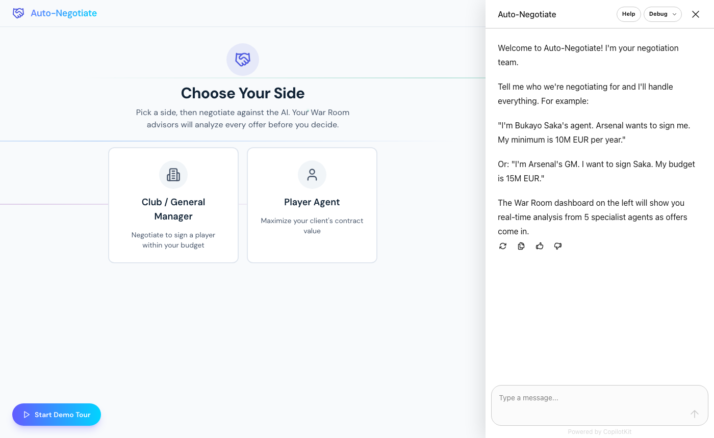
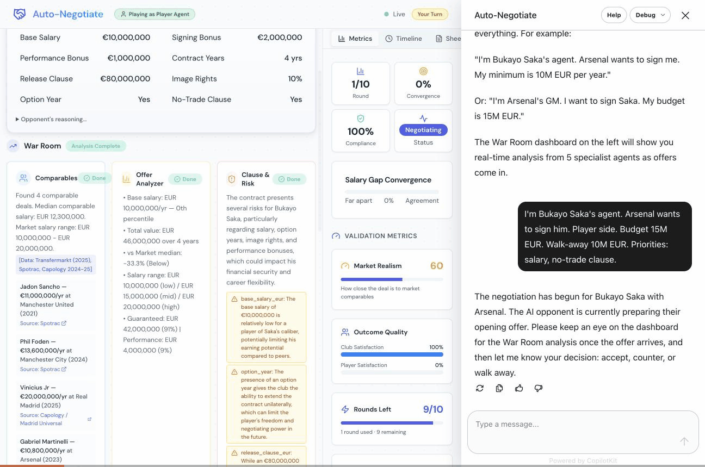
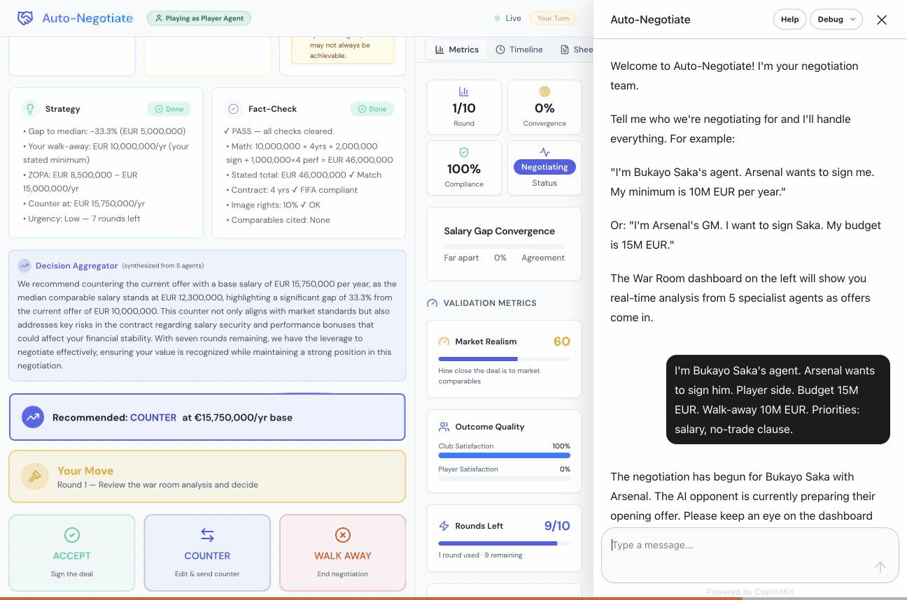
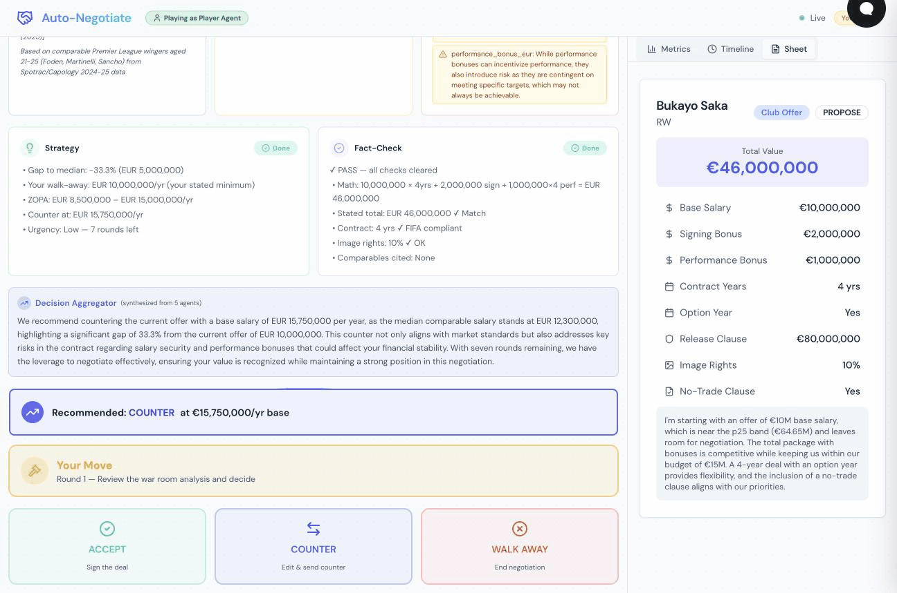
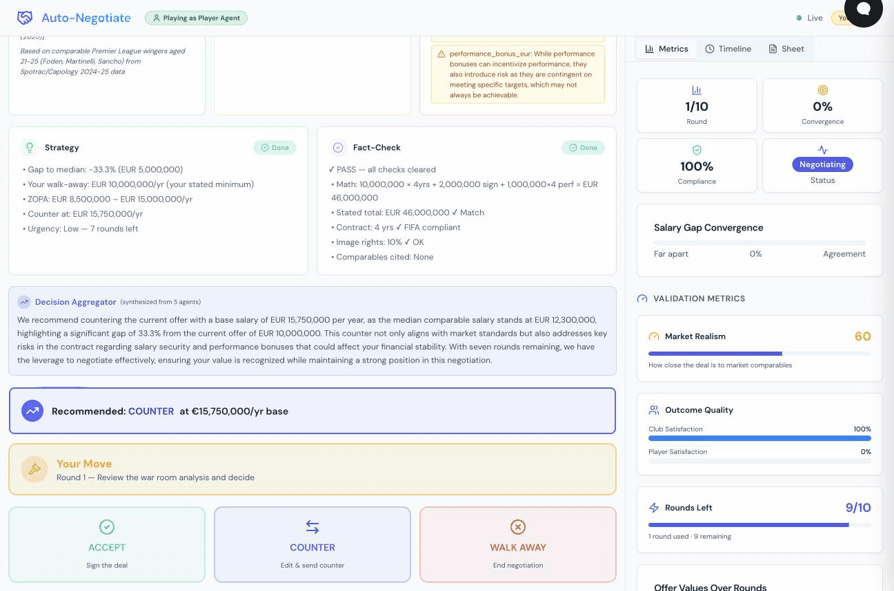
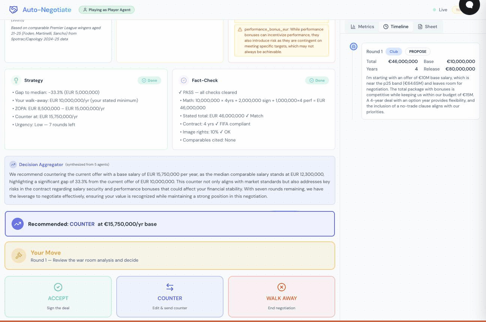

# Auto-Negotiate

**Autonomous Multi-Agent Sports Contract Negotiation System**

A full-stack AI-powered platform for simulating and analyzing football (soccer) player contract negotiations. Built as a capstone project for **CMU 18-738: Sports Technology** (Spring 2026).

Auto-Negotiate combines a **Next.js 14** frontend with a **FastAPI + LangGraph** backend to create a human-in-the-loop (HITL) negotiation experience where the user plays as either a Club General Manager or a Player's Agent, negotiating against an AI opponent advised by a 5-agent "War Room" of specialist advisors.

---

## Evaluation Results

We ran 300 fully automated negotiations (100 per condition) comparing the multi-agent system against a Vanilla ChatGPT baseline. Results are comprehensively documented in:

**[RESULTS.md](RESULTS.md) -- Full evaluation report with 10 figures, statistical tests, and three-way comparison**

### Quick Summary (Auto-Negotiate mini vs Vanilla ChatGPT)

| Metric | Auto-Negotiate | Vanilla ChatGPT | Winner |
|--------|---------------|-----------------|--------|
| Market Alignment (judge) | **9.38 / 10** | 8.69 / 10 | Auto-Negotiate (p=0.002) |
| Contract Structure (judge) | 5.73 / 10 | **7.27 / 10** | Vanilla (p<0.001) |
| Club Outcome Quality | **19.9 / 100** | 12.4 / 100 | Auto-Negotiate (p=0.015) |
| Player Outcome Quality | 43.7 / 100 | **55.1 / 100** | Vanilla (p<0.001) |
| Overall Judge Score | 6.89 / 10 | **7.47 / 10** | Vanilla (p=0.002) |
| Final Salary | EUR 16.56M | EUR 16.58M | Tie (p=0.985) |
| Outcome Diversity | ACCEPTED/MAX/WALK | ACCEPTED only | Auto-Negotiate |

**Key insight:** All three systems converge to the same final salary (~EUR 16.57M). Architecture and model choice determine process quality, not the negotiated number. Auto-Negotiate wins on market constraint enforcement; Vanilla wins on contract structure coherence.

For figures, statistical tests, budget tier breakdowns, position analysis, and the LaTeX table for the paper, see **[RESULTS.md](RESULTS.md)**.

---

## Table of Contents

- [Demo](#demo)
- [Features](#features)
- [Architecture](#architecture)
  - [System Overview](#system-overview)
  - [Two-Graph HITL Pattern](#two-graph-hitl-pattern)
  - [War Room (5-Agent Advisory)](#war-room-5-agent-advisory)
  - [Adapter Pattern for Team Integration](#adapter-pattern-for-team-integration)
- [Tech Stack](#tech-stack)
- [Project Structure](#project-structure)
- [Getting Started](#getting-started)
  - [Prerequisites](#prerequisites)
  - [Backend Setup](#backend-setup)
  - [Frontend Setup](#frontend-setup)
  - [Running the Full System](#running-the-full-system)
- [Detailed Component Reference](#detailed-component-reference)
  - [Backend: Agents](#backend-agents)
  - [Backend: Negotiation Engine](#backend-negotiation-engine)
  - [Backend: API Endpoints](#backend-api-endpoints)
  - [Frontend: Pages and Layout](#frontend-pages-and-layout)
  - [Frontend: Negotiation Components](#frontend-negotiation-components)
  - [Frontend: State Management](#frontend-state-management)
- [Data Pipeline](#data-pipeline)
  - [Player Database](#player-database)
  - [ML Predictor](#ml-predictor)
  - [Salary Range Methodology](#salary-range-methodology)
  - [Comparable Deal Sourcing](#comparable-deal-sourcing)
- [Constraint Validation System](#constraint-validation-system)
  - [6-Layer Constraint Checker](#6-layer-constraint-checker)
  - [Default 4-Layer Constraint Checker](#default-4-layer-constraint-checker)
  - [FIFA Rule Coverage](#fifa-rule-coverage)
- [Validation Metrics](#validation-metrics)
- [CopilotKit Integration](#copilotkit-integration)
- [Testing](#testing)
- [Team](#team)
- [License](#license)

---

## Demo

### Animated Demo


### Screenshots

<table>
<tr>
<td align="center" width="50%">
<br/>
<em>Choose your side — Club GM or Player Agent</em>
</td>
<td align="center" width="50%">
<br/>
<em>5-agent War Room analysis of the incoming offer</em>
</td>
</tr>
<tr>
<td align="center" width="50%">
<br/>
<em>Decision panel — Accept, Counter, or Walk Away</em>
</td>
<td align="center" width="50%">
<br/>
<em>Live term sheet with full contract breakdown</em>
</td>
</tr>
<tr>
<td align="center" width="50%">
<br/>
<em>Validation metrics — Market Realism, Compliance, Rounds</em>
</td>
<td align="center" width="50%">
<br/>
<em>Full layout — War Room + Offer Timeline side-by-side</em>
</td>
</tr>
</table>

The system includes a built-in **12-step guided demo tour** that walks through every feature:

1. Side selection (Club GM vs Player Agent)
2. Negotiation parameter setup (player, club, budget, priorities)
3. AI opponent's opening offer with real-time agent pipeline
4. Incoming offer card with market comparison badges
5. War Room 5-agent analysis (Comparables, Offer Analyzer, Clause & Risk, Strategy, Fact-Check)
6. Decision Aggregator synthesized recommendation
7. User decision panel (Accept / Counter / Walk Away)
8. Counter-offer form with live total value calculator
9. Offer timeline showing convergence across rounds
10. Validation metrics (Market Realism, Outcome Quality, Efficiency, Compliance)
11. Offer values chart tracking both sides over rounds
12. Complete screen with final term sheet and export

---

## Features

### Negotiation Engine
- **Human-in-the-Loop (HITL)** negotiation with pause/resume via LangGraph's two-graph pattern
- **AI Opponent Agents** (Club GM and Player Agent) powered by GPT-4o-mini with structured output and few-shot examples
- **Concession strategy enforcement** — agents must move 5-15% toward the opponent's position each round
- **Walk-away detection** with configurable thresholds (user-specified or market-derived)
- **Max 8 rounds** with urgency escalation in final 2 rounds

### War Room (5-Agent Advisory)
- **Comparables Agent** — curated comparable deals from top-5 European leagues with median salary analysis
- **Offer Analyzer** — salary breakdown vs market band percentile, guaranteed vs performance split
- **Clause & Risk Agent** — LLM-powered clause analysis with perspective-aware risk assessment (player vs club)
- **Strategy Agent** — BATNA, ZOPA, walk-away thresholds, and optimal counter-offer computation
- **Fact-Check Agent** — term sheet arithmetic verification, FIFA compliance, comparables citation check
- **Decision Aggregator** — LLM synthesis of all 5 agents into a single coherent recommendation paragraph

### Market Intelligence
- **XGBoost ML Model** (R-squared ~0.83) predicting transfer market value from player statistics
- **Curated salary ranges** for 20 elite players (sourced from Spotrac, Capology, Transfermarkt 2024-25)
- **Position-based fallback** estimates for unknown players with age depreciation factors
- **Top-tier club filtering** — excludes Saudi Pro League, MLS, Turkish Super Lig from salary comparables
- **Outlier removal** — comparables >3x median automatically excluded

### Constraint Validation
- **6-layer FIFA constraint checker** (schema, official FIFA RSTP rules, project policies, round rules, offer history, side-specific)
- **Dynamic budget/salary caps** derived per-negotiation from club constraints (not hardcoded)
- **Stagnation detection** — flags identical repeated offers
- **Action sequencing** — prevents actions after accept/walk-away
- **User counter-offer validation** — constraint checker runs on both AI and user decisions

### Frontend Experience
- **CopilotKit chat sidebar** — natural language negotiation ("counter at 13 million", "accept", "walk away")
- **Real-time SSE streaming** — live agent pipeline updates from backend to frontend
- **Dark-themed dashboard** with animated UI components (Aceternity UI)
- **Zustand state management** for reactive negotiation state
- **Offer timeline chart** (Recharts) showing salary convergence across rounds
- **Export** negotiation reports as JSON or formatted text with citations
- **Guided demo tour** with 12 interactive steps

---

## Architecture

### System Overview

```
┌─────────────────────────────────────────────────────────────────┐
│                        FRONTEND (Next.js 14)                     │
│                                                                   │
│  ┌──────────────┐  ┌──────────────┐  ┌─────────────────────┐    │
│  │  CopilotKit   │  │   Zustand    │  │  React Components   │    │
│  │  Chat Sidebar │  │   Stores     │  │  (Negotiate, UI)    │    │
│  └──────┬───────┘  └──────┬───────┘  └─────────┬───────────┘    │
│         │                  │                     │                 │
│         │    useCopilotAction    useNegotiationEvents (SSE)       │
│         │    useCopilotReadable                                   │
└─────────┼──────────────────┼─────────────────────┼───────────────┘
          │                  │                     │
          ▼                  │                     ▼
┌─────────────────┐          │         ┌──────────────────────┐
│  /api/copilotkit │          │         │  localhost:8100/api/  │
│  (Next.js route) │          │         │  stream/{id} (SSE)   │
└─────────────────┘          │         └──────────┬───────────┘
                             │                    │
┌────────────────────────────┼────────────────────┼───────────────┐
│                      BACKEND (FastAPI + LangGraph)               │
│                                                                   │
│  ┌─────────────────────────────────────────────────────────────┐ │
│  │                    Negotiate Router                          │ │
│  │  POST /api/negotiate  →  Opening Graph (async task)         │ │
│  │  GET  /api/stream/{id} →  SSE event stream                  │ │
│  │  POST /api/decide/{id} →  Round Graph (async task)          │ │
│  │  GET  /api/metrics/{id} → Validation metrics                │ │
│  └──────────────────────────┬──────────────────────────────────┘ │
│                              │                                    │
│  ┌───────────────────────────┼────────────────────────────────┐  │
│  │              LangGraph Two-Graph HITL Pattern               │  │
│  │                                                             │  │
│  │  Opening Graph:                                             │  │
│  │  market_predictor → ai_club_proposes → constraint_check     │  │
│  │       → war_room → END (pause for user)                     │  │
│  │                                                             │  │
│  │  Round Graph:                                               │  │
│  │  apply_user_decision → ai_club_proposes → constraint_check  │  │
│  │       → war_room → END (pause for user)                     │  │
│  └───────────────────────────┬────────────────────────────────┘  │
│                              │                                    │
│  ┌─────────────┐  ┌─────────┴──────────┐  ┌──────────────────┐  │
│  │  Adapters    │  │    War Room        │  │  LLM Agents      │  │
│  │  (Interface) │  │  (5 Specialists)   │  │  (Club/Player)   │  │
│  │             │  │                    │  │                  │  │
│  │ ML Predictor ◄──┤  Comparables       │  │  GPT-4o-mini     │  │
│  │             │  │  Offer Analyzer    │  │  Structured Out   │  │
│  │             │  │  Clause & Risk     │  │  Few-shot Prompts │  │
│  │ Advanced    │  │  Strategy Advisor  │  │                  │  │
│  │ Constraint  │  │  Fact-Checker      │  │                  │  │
│  │ Checker     │  │  Decision Agg.     │  │                  │  │
│  └─────────────┘  └────────────────────┘  └──────────────────┘  │
│                                                                   │
│  ┌─────────────────────────────────────────────────────────────┐ │
│  │                       Data Layer                             │ │
│  │  sample_players.json  │  official_fifa_rules.json            │ │
│  │  league_rules.json    │  project_policy_rules.json           │ │
│  │  player_valuation_processed.csv (ML training data)           │ │
│  └─────────────────────────────────────────────────────────────┘ │
└──────────────────────────────────────────────────────────────────┘
```

### Two-Graph HITL Pattern

Unlike a simple request-response loop, Auto-Negotiate uses LangGraph's **two-graph pause/resume** pattern to support human-in-the-loop decision-making:

1. **Opening Graph** — Runs when a negotiation starts:
   - Market Predictor → AI Club Proposes → Constraint Check → War Room → **END** (pause)
   - The graph terminates after the War Room analysis, leaving the system in an `AWAITING_USER_DECISION` state.

2. **Round Graph** — Runs each time the user submits a decision:
   - Apply User Decision → AI Club Proposes → Constraint Check → War Room → **END** (pause)
   - If the user ACCEPTs or WALKs AWAY, the graph short-circuits to END.

This pattern means the backend never blocks waiting for user input — it runs a graph, terminates, and waits for the next API call.

### War Room (5-Agent Advisory)

When the AI opponent makes an offer, the War Room runs 5 specialist analyses before the user decides:

| Agent | Type | Purpose |
|-------|------|---------|
| **Comparables** | Deterministic | Finds 3-6 comparable player deals from curated database, computes median salary |
| **Offer Analyzer** | Deterministic | Breaks down offer vs market band: percentile position, guaranteed vs performance split |
| **Clause & Risk** | LLM (GPT-4o-mini) | Analyzes contract clauses from the user's perspective (player-side or club-side) |
| **Strategy Advisor** | Deterministic | Computes BATNA, ZOPA, walk-away thresholds, recommends optimal counter-offer |
| **Fact-Checker** | Deterministic | Verifies term sheet math, FIFA compliance, comparables citations |
| **Decision Aggregator** | LLM (GPT-4o-mini) | Synthesizes all 5 analyses into one coherent recommendation paragraph |

The War Room is perspective-aware — when the user plays as the Player's Agent, the Clause & Risk analysis identifies risks *to the player* (e.g., "club-favoring option year"), not generic risks.

### Adapter Pattern for Team Integration

ML and constraint checking components are integrated via an **adapter pattern** that provides clean interfaces with safe fallbacks:

```python
class IMarketPredictor(ABC):
    def predict(self, player_profile: dict) -> dict: ...

class IConstraintChecker(ABC):
    def check(self, term_sheet, market_context, rounds, current_round, club_constraints) -> dict: ...

# Swap implementations at startup:
set_predictor(MLPredictor())          # Falls back to DefaultMarketPredictor on error
set_checker(AdvancedConstraintChecker()) # Falls back to DefaultConstraintChecker on error
```

If the ML model file is missing or the advanced checker raises an unexpected exception, the system gracefully falls back to built-in defaults without crashing.

---

## Tech Stack

| Layer | Technology | Purpose |
|-------|-----------|---------|
| **Frontend Framework** | Next.js 14 (App Router) | Server-side rendering, API routes |
| **Chat Interface** | CopilotKit | AI chat sidebar with action registration |
| **State Management** | Zustand | Reactive negotiation state |
| **UI Components** | shadcn/ui + Aceternity UI | Cards, badges, tabs, animated effects |
| **Charts** | Recharts | Offer convergence line chart |
| **Styling** | Tailwind CSS 3 | Dark theme with custom CSS variables |
| **Animations** | Framer Motion | Page transitions, sparkle effects |
| **Backend Framework** | FastAPI | Async REST API with SSE |
| **Agent Orchestration** | LangGraph | Two-graph HITL state machine |
| **LLM** | GPT-4o-mini (via LangChain) | Club/Player agents, Clause Risk, Decision Aggregator |
| **ML Model** | XGBoost (scikit-learn) | Transfer value prediction (R² ~0.83) |
| **Validation** | Pydantic v2 | TermSheet schema, API request/response models |
| **Real-time** | SSE (sse-starlette) | Backend → Frontend event streaming |

---

## Project Structure

```
sports-analytics/
├── .env.example                    # Environment template (copy to .env)
├── .gitignore
├── README.md
├── Sports_Tech_Project.pptx.pdf    # Project presentation
├── docs/
│   └── screenshots/                # Demo screenshots (add here)
│
├── backend/                        # FastAPI + LangGraph
│   ├── orchestrator/
│   │   ├── main.py                 # App entry point, adapter initialization
│   │   ├── config.py               # Settings (model, ports, timeouts)
│   │   └── routers/
│   │       └── negotiate.py        # REST + SSE endpoints
│   │
│   ├── agents/
│   │   ├── adapters.py             # IMarketPredictor / IConstraintChecker ABCs
│   │   ├── ml_predictor.py         # XGBoost ML model for market value prediction
│   │   ├── advanced_constraint_checker.py  # 6-layer FIFA + policy checker
│   │   ├── constraint_checker.py   # Default 4-layer constraint checker
│   │   ├── market_predictor.py     # Default predictor (sample_players.json)
│   │   ├── club_agent.py           # AI Club GM (GPT-4o-mini)
│   │   ├── player_agent.py         # AI Player Agent (GPT-4o-mini)
│   │   ├── strategy_advisor.py     # BATNA / ZOPA computation
│   │   └── war_room.py             # 5-agent advisory + Decision Aggregator
│   │
│   ├── negotiation/
│   │   ├── graph.py                # LangGraph two-graph definitions
│   │   ├── state.py                # NegotiationState dataclass
│   │   ├── term_sheet.py           # Pydantic TermSheet + ActionType models
│   │   ├── prompts.py              # System prompts + few-shot examples
│   │   └── metrics.py              # Validation metric computations
│   │
│   ├── data/
│   │   ├── sample_players.json     # 20 elite players with curated market data
│   │   ├── official_fifa_rules.json # FIFA RSTP 2025 regulations
│   │   ├── project_policy_rules.json # Negotiation policies
│   │   └── league_rules.json       # League-specific rules (EPL, La Liga, etc.)
│   │
│   ├── requirements.txt
│   └── pyproject.toml
│
├── frontend/                       # Next.js 14 + CopilotKit
│   ├── app/
│   │   ├── layout.tsx              # CopilotKit wrapper + chat instructions
│   │   ├── page.tsx                # Main page with useCopilotAction hooks
│   │   ├── globals.css             # Dark theme + CopilotKit CSS overrides
│   │   └── api/copilotkit/
│   │       └── route.ts            # CopilotKit runtime endpoint
│   │
│   ├── components/
│   │   ├── negotiate/
│   │   │   ├── SideSelector.tsx    # Club GM vs Player Agent selection
│   │   │   ├── IncomingOfferCard.tsx  # Opponent's offer with market badges
│   │   │   ├── WarRoomPanel.tsx    # 5-agent analysis dashboard
│   │   │   ├── DecisionPanel.tsx   # Accept / Counter / Walk Away buttons
│   │   │   ├── CounterOfferForm.tsx # Counter-offer form with live total
│   │   │   ├── AgentPipeline.tsx   # Agent status visualization
│   │   │   ├── AgentCard.tsx       # Individual agent card
│   │   │   ├── TermSheetCard.tsx   # Term sheet display with diff
│   │   │   ├── OfferTimeline.tsx   # Round-by-round offer history
│   │   │   ├── NegotiationMetrics.tsx  # Recharts metrics dashboard
│   │   │   ├── NegotiateMessages.tsx   # Custom CopilotKit messages
│   │   │   └── ExportButton.tsx    # Export negotiation report
│   │   │
│   │   ├── demo/
│   │   │   ├── GuidedTour.tsx      # Interactive tour overlay
│   │   │   ├── DemoButton.tsx      # Floating "Start Demo" button
│   │   │   └── demoTourSteps.ts    # 12-step tour definition
│   │   │
│   │   └── ui/                     # shadcn/ui + Aceternity components
│   │       ├── card.tsx, button.tsx, badge.tsx, tabs.tsx, progress.tsx
│   │       └── aceternity/         # Animated effects (sparkles, aurora, etc.)
│   │
│   ├── hooks/
│   │   └── useNegotiationEvents.ts # SSE connection to backend stream
│   │
│   ├── lib/
│   │   ├── types.ts                # TypeScript interfaces (TermSheet, etc.)
│   │   ├── utils.ts                # cn(), formatEUR(), formatRound()
│   │   └── stores/
│   │       └── negotiationStore.ts # Zustand store
│   │
│   ├── contexts/
│   │   └── ChatLoadingContext.tsx   # Chat loading state
│   │
│   ├── package.json
│   ├── next.config.js
│   ├── tailwind.config.js
│   ├── tsconfig.json
│   └── postcss.config.js
```

---

## Getting Started

### Prerequisites

- **Node.js** >= 18 ([install](https://nodejs.org/))
- **Python** >= 3.10 ([install](https://www.python.org/downloads/))
- **OpenAI API Key** — you need a key with access to `gpt-4o-mini` ([get one here](https://platform.openai.com/api-keys))

### Step 1: Clone the Repository

```bash
git clone <your-repo-url>
cd sports-analytics
```

### Step 2: Set Up Environment Variables

```bash
# Root .env (used by the backend)
cp .env.example .env
# Edit .env — replace sk-your-key-here with your real OpenAI API key:
#   OPENAI_API_KEY=sk-proj-...
#   BACKEND_URL=http://localhost:8100

# Frontend .env.local (used by Next.js)
cp frontend/.env.example frontend/.env.local
# Edit frontend/.env.local — same API key:
#   OPENAI_API_KEY=sk-proj-...
#   BACKEND_URL=http://localhost:8100
```

> **Both files need the same `OPENAI_API_KEY`.** The backend uses it for the Club/Player LLM agents and War Room analysis. The frontend uses it for the CopilotKit chat sidebar.

### Step 3: Backend Setup

```bash
cd backend

# Create and activate a virtual environment
python3 -m venv .venv
source .venv/bin/activate   # macOS / Linux
# .venv\Scripts\activate    # Windows

# Install all Python dependencies
pip install -r requirements.txt

# Start the backend server
python -m orchestrator.main
# → Runs on http://localhost:8100
# → You should see:
#   "Activated the advanced constraint checker"
#   "Activated ML market predictor"
```

**Note on the ML model:** The XGBoost model file (`player_valuation_model.joblib`, ~2MB) and its training data (`player_valuation_processed.csv`, ~108MB) are **not included in the repo** (too large for git). The system works perfectly without them — it falls back to curated market data from `sample_players.json` for all 20 supported players. If you want to use the ML model:

```bash
# Place the training CSV in backend/data/player_valuation_processed.csv
# Then train the model:
python -m agents.abdullah_predictor
# → Creates backend/data/player_valuation_model.joblib
# → Next server restart will use the ML model automatically
```

### Step 4: Frontend Setup

Open a **new terminal** (keep the backend running):

```bash
cd frontend

# Install Node.js dependencies
npm install

# Start the Next.js dev server
npm run dev
# → Runs on http://localhost:3000
```

### Step 5: Use the App

1. Open **http://localhost:3000** in your browser
2. Click **"Start Demo Tour"** for a guided walkthrough of every feature
3. Or type in the chat sidebar:
   > "I'm Bukayo Saka's agent. Arsenal wants to sign me. My minimum is 10M EUR per year."
4. Watch the AI opponent make an offer, the War Room analyze it, and then decide: accept, counter, or walk away

### Supported Players (for demo)

The system has curated market data for 20 elite players. You can negotiate for any of them by name:

> Bukayo Saka, Erling Haaland, Pedri, Kylian Mbappe, Mohamed Salah, Jude Bellingham, Lamine Yamal, Declan Rice, Florian Wirtz, Cole Palmer, William Saliba, Rodri, Martin Odegaard, Virgil van Dijk, Bruno Fernandes, Ruben Dias, Son Heung-min, Jamal Musiala, Viktor Gyokeres, Alexander Isak

For players not in this list, the system uses position-based estimates.

### Troubleshooting

| Problem | Solution |
|---------|----------|
| Backend: `ModuleNotFoundError` | Make sure you activated the venv: `source .venv/bin/activate` |
| Backend: `OPENAI_API_KEY` empty | Check that `.env` exists in the project root (not in `backend/`) |
| Frontend: Chat not responding | Check that `frontend/.env.local` has the API key |
| Frontend: "Backend error" toast | Make sure the backend is running on port 8100 |
| SSE not connecting | The frontend connects directly to `localhost:8100` — make sure no firewall blocks it |
| `Address already in use :8100` | Kill the old process: `lsof -ti:8100 \| xargs kill -9` |

---

## Detailed Component Reference

### Backend: Agents

#### `abdullah_predictor.py` — XGBoost Market Value Predictor

the ML model predicts a player's transfer market value using an XGBoost regressor trained on historical player valuation data.

**How it works:**
1. Loads `player_valuation_processed.csv` — historical snapshots of player stats + market values
2. Trains on 38 features: age, position, goals/assists/minutes (365d and 180d windows), previous log value, one-hot encoded position/sub-position/foot
3. Predicts `delta_log_value` (change in log market value from previous snapshot)
4. Converts back to EUR: `exp(prev_log_value + delta_predicted)`
5. For salary range: first checks `sample_players.json` for curated salary data; if not found, applies tiered percentage conversion (12-24% for elite players, 8-18% for others)

**Key design decisions:**
- Predicts *transfer value*, not salary — salary ranges are derived separately because the salary-to-transfer-value ratio varies significantly by player tier
- Falls back to `DefaultMarketPredictor` (position-based estimates) if the player isn't in the training CSV
- Passes curated comparables from `sample_players.json` alongside ML predictions so the War Room has real salary data

#### `smriti_constraint_checker.py` — 6-Layer FIFA Constraint Checker

the advanced constraint checker validates term sheets against FIFA regulations, project policies, and negotiation rules. It runs 6 validation layers:

| Layer | Name | Checks |
|-------|------|--------|
| 1 | **Schema** | Required fields, numeric types, value ranges |
| 2 | **Official FIFA Rules** | Contract length limits (5yr max, 3yr for U-18), pre-contract windows, medical exam conditions, minor transfer rules, loan rules, agent fee caps |
| 3 | **Project Policy** | Budget caps, salary ranges, market alignment, performance bonus limits, sell-on clause limits |
| 4 | **Round Rules** | Max rounds, valid actions, negotiation-already-closed detection |
| 5 | **Offer History** | Stagnation detection (identical repeated offers) |
| 6 | **Side-Specific** | Player-side guarantee checks |

**Integration notes:**
- The wrapper (`check_constraints_advanced`) translates between our TermSheet format and the checker's offer/round_state format
- Dynamic budget/salary caps are injected per-negotiation from `club_constraints.budget_eur` — not hardcoded
- Actions are lowercased before validation (our pipeline uses uppercase, the constraint validators use lowercase)
- `performance_bonus_eur` is treated as an annual figure (multiplied by contract years for total value computation)
- `release_clause_eur = 0` (no release clause) is not flagged as an error — only validated when > 0
- Deep copy prevents cross-session state leakage in the rule cache

#### `war_room.py` — 5-Agent Advisory System

The War Room is the core advisory layer. When the AI opponent makes an offer, all 5 agents analyze it before the user decides.

**Comparables filtering pipeline:**
1. Load player's own curated comparables from `sample_players.json`
2. Merge with predictor comparables if available
3. Supplement from same-position DB players if < 3 results
4. Filter: exclude self-references, non-top-tier clubs (Saudi/MLS/Turkish), age > ±7 years, deduplicate
5. Outlier removal: exclude salaries > 3x preliminary median
6. Cap at 6 comparables
7. Compute **median** (not mean) comparable salary

**Strategy computation:**
- Walk-away threshold: always honors user's explicitly stated threshold first; falls back to market-derived only if user didn't specify
- Recommended counter: anchored to salary range midpoint, never below walk-away
- Urgency detection: "HIGH" when ≤ 2 rounds remaining

#### `club_agent.py` / `player_agent.py` — AI Negotiating Agents

LLM-powered agents using GPT-4o-mini with structured output (`llm.with_structured_output(TermSheetAction)`).

**Key prompt engineering decisions:**
- Few-shot examples with explicit salary numbers and reasoning
- Concession strategy enforcement: "You MUST concede at least 5-15% per round toward the opponent's position"
- Agents must reference the opponent's last offer specifically and explain their movement
- Deterministic fallback functions if LLM call fails (30% concession per round)

### Backend: Negotiation Engine

#### `graph.py` — LangGraph State Machine

Defines two compiled LangGraph graphs:

**Opening Graph:** `market_predictor → ai_club_proposes → constraint_check → war_room → END`

**Round Graph:** `apply_user_decision → ai_club_proposes → constraint_check → war_room → END`

Conditional edges handle terminal states (ACCEPTED, WALKED_AWAY, MAX_ROUNDS) by short-circuiting to END.

User counter-offers are constraint-checked before being passed to the AI opponent, ensuring both sides' offers are validated.

#### `state.py` — NegotiationState

A Python dataclass containing the full negotiation state:

- Player profile, club constraints, priorities
- User side (club/player), walk-away threshold
- Market context (from predictor)
- Rounds history (with term sheets, reasoning, violations)
- War Room results, user decision
- Session metadata (status, active agent, logs)

Serializable to/from dict for LangGraph TypedDict compatibility.

#### `term_sheet.py` — Pydantic Models

- **TermSheet**: player_name, position, base_salary_eur, signing_bonus_eur, performance_bonus_eur, contract_years, option_year, release_clause_eur, image_rights_pct, no_trade_clause. Computed `total_value_eur` property.
- **ActionType**: PROPOSE, COUNTER, ACCEPT, WALK_AWAY
- **TermSheetAction**: action + optional term_sheet + reasoning. Validates that PROPOSE/COUNTER require a term sheet.

### Backend: API Endpoints

| Method | Path | Description |
|--------|------|-------------|
| `POST` | `/api/negotiate` | Start a new negotiation. Returns `request_id` + `stream_url`. |
| `GET` | `/api/stream/{request_id}` | SSE event stream (market_prediction, opponent_offer, constraint_check, war_room_complete, negotiation_complete) |
| `POST` | `/api/decide/{request_id}` | Submit user decision (ACCEPT, COUNTER, WALK_AWAY). Triggers next round graph. |
| `GET` | `/api/negotiation/{request_id}` | Get full negotiation state (for debugging / polling). |
| `GET` | `/api/metrics/{request_id}` | Get validation metrics for the session. |
| `GET` | `/health` | Health check. |

### Frontend: Pages and Layout

#### `layout.tsx`

Wraps the entire app in:
- `<CopilotKit runtimeUrl="/api/copilotkit">` — chat runtime
- `<CopilotSidebar>` — chat panel with negotiation instructions
- `<ChatLoadingProvider>` — loading state context
- `<Toaster>` — toast notifications

The `COPILOT_INSTRUCTIONS` constant is a detailed system prompt that teaches the CopilotKit LLM how to:
1. Start negotiations via `startNegotiation` action
2. Submit decisions via `submitDecision` action
3. Proactively advise the user using `useCopilotReadable` live state

#### `page.tsx`

The main page registers three CopilotKit actions:
- **startNegotiation** — parses user's natural language into structured parameters and calls the backend
- **submitDecision** — maps "accept", "counter at 13M", "walk away" to API calls
- **getNegotiationContext** — returns full state for advisory questions

Also exposes live negotiation state via `useCopilotReadable` so the chat can proactively advise:
> "Arsenal just offered EUR 6.5M/yr base (EUR 35M total). The War Room recommends COUNTER at EUR 10.8M/yr — the market median for comparable players."

### Frontend: Negotiation Components

| Component | Purpose |
|-----------|---------|
| **SideSelector** | Initial setup: choose Club GM or Player Agent, configure player/club/budget/priorities |
| **IncomingOfferCard** | Displays opponent's offer with market comparison badges (below/at/above market) |
| **WarRoomPanel** | 5-agent analysis cards with real-time status + Decision Aggregator synthesis |
| **DecisionPanel** | Accept / Counter / Walk Away action buttons |
| **CounterOfferForm** | Editable form for counter-offers with live total value calculator |
| **AgentPipeline** | Horizontal pipeline showing agent execution status (idle → active → complete) |
| **AgentCard** | Individual agent card with status indicator and description |
| **TermSheetCard** | Term sheet display with diff highlighting from previous round |
| **OfferTimeline** | Vertical timeline of all rounds with salary amounts |
| **NegotiationMetrics** | Dashboard with Market Realism, Outcome Quality, Efficiency, Compliance, Convergence chart |
| **ExportButton** | Export full negotiation as JSON or formatted text report |
| **NegotiateMessages** | Custom CopilotKit message rendering |

### Frontend: State Management

**Zustand Store** (`negotiationStore.ts`):
- Tracks rounds, agents, status, market context, war room results
- Computed helpers: `getSalaryGap()`, `getLatestOffer()`, `getOpponentSide()`
- `submitDecision()` — calls backend `/api/decide/{id}` and reconnects SSE stream

**SSE Hook** (`useNegotiationEvents.ts`):
- Connects directly to `localhost:8100/api/stream/{id}` (bypasses Next.js proxy to avoid SSE buffering)
- Handles named events: `market_prediction`, `opponent_offer`, `constraint_check`, `war_room_complete`, `negotiation_complete`
- Updates Zustand store in real-time as events arrive

---

## Data Pipeline

### Player Database

`sample_players.json` contains 20 elite football players with curated market data:

**Players:** Bukayo Saka, Erling Haaland, Pedri, Kylian Mbappe, Mohamed Salah, Jude Bellingham, Lamine Yamal, Declan Rice, Florian Wirtz, Cole Palmer, William Saliba, Rodri, Martin Odegaard, Virgil van Dijk, Bruno Fernandes, Ruben Dias, Son Heung-min, Jamal Musiala, Viktor Gyokeres, Alexander Isak

Each entry includes:
- **Profile**: name, age, position, current club, nationality
- **Stats**: goals, assists, appearances, minutes, pass completion, dribbles (2023-24 season)
- **Contract**: expiry, signed date, annual salary, weekly wage (with source URLs)
- **Market Context**: predicted transfer value, salary range (low/mid/high with methodology), 3-4 comparable deals with citations

### ML Predictor

**Model**: XGBoost Regressor
- 500 estimators, learning rate 0.05, max depth 6
- Trained on `player_valuation_processed.csv` (historical Transfermarkt valuations)
- **Target**: `delta_log_value` (change in log market value between snapshots)
- **Features** (38): club ID, age, age², goals/assists/minutes/cards for 365d and 180d windows, previous log value, one-hot position/sub-position/foot
- **Time-aware split**: train on data before 2023-12-31, test on data after
- **R² ~0.83** on test set

**Prediction flow:**
1. Look up player in training CSV by name (case-insensitive, slug-aware)
2. Build 38-feature vector from most recent snapshot
3. Predict `delta_log_value` → `exp(prev_log + delta)` → EUR transfer value
4. Derive salary range from `sample_players.json` if available, otherwise from tiered percentage formula

### Salary Range Methodology

For players in the database, salary ranges are **manually researched** from Spotrac, Capology, and GiveMeSport (2024-25 season data).

For players not in the database, salary ranges are derived from the ML transfer value using tiered percentages:

| Transfer Value | Low % | Mid % | High % |
|---------------|-------|-------|--------|
| ≥ EUR 80M | 12% | 17% | 24% |
| ≥ EUR 40M | 10% | 14% | 20% |
| < EUR 40M | 8% | 12% | 18% |

This tiered approach reflects the reality that elite players command a higher salary-to-transfer-value ratio.

### Comparable Deal Sourcing

Comparables are curated from:
- **Spotrac** (spotrac.com/epl/) — Premier League salary data
- **Capology** (capology.com) — Multi-league salary estimates
- **Transfermarkt** (transfermarkt.us) — Transfer fees and valuations
- **GiveMeSport**, **CBS Sports**, **beIN Sports** — Contract details for specific deals

Each comparable includes: player name, annual salary (EUR), club, year, age at signing, transfer fee, source, and source URL.

**Filtering rules:**
- Only top-5 European league clubs (EPL, La Liga, Bundesliga, Serie A, Ligue 1 elite)
- Explicitly excluded: Saudi Pro League, MLS, Turkish Super Lig
- Age bracket: ±7 years of the negotiation subject
- Outlier removal: salaries >3x preliminary median excluded
- Self-reference exclusion: a player never appears as their own comparable
- Deduplication by name

---

## Constraint Validation System

### 6-Layer Constraint Checker

Ported from the original Jupyter notebook (`constraint_checker_final.ipynb`) into a production-ready Python module.

**Layer 1 — Schema Validation:**
- Required fields: player_name, club_name, base_salary_eur, contract_years, guaranteed_amount_eur
- Numeric type validation for 16 financial fields
- Non-negative value enforcement
- Integer contract years

**Layer 2 — Official FIFA Rules (RSTP Jan 2025):**
- Max contract years: 5 (default), 3 (under-18)
- Pre-contract window: 6 months before expiry
- Medical exam / work permit conditions prohibited
- No unilateral termination during competition period
- Minor international transfer restrictions
- Loan rules: max 1 year, written agreement required, no sub-loans
- Agent fee caps by representation type

**Layer 3 — Project Policy Rules:**
- Dynamic budget cap (from negotiation's club constraints)
- Dynamic salary min/max (from club constraints)
- Market alignment: salary within 0.4x–1.6x of reference value
- Performance bonus: max 2x base salary
- Sell-on clause: max 25% preferred

**Layer 4 — Round Rules:**
- Max rounds enforcement (10, configurable)
- Valid action set: propose, counter, accept, reject, walk_away
- No action after accept or walk_away
- Counter requires an offer, accept should not include one

**Layer 5 — Offer History:**
- Stagnation detection: identical offers repeated 2+ times

**Layer 6 — Side-Specific:**
- Player-side: guaranteed amount should not be less than one year of base salary

### Default 4-Layer Constraint Checker

A simpler built-in checker used as fallback:
- **L0 Format**: required fields, numeric types
- **L1 Sanity**: contract years 1-5, non-negative values, image rights ≤50%, bonus ratios, budget check, total value verification
- **L2 Market**: salary within tolerance band of market mid (default 0.5x–2.0x)
- **L3 Protocol**: no repeated identical offers from same side

### FIFA Rule Coverage

| Rule | Source | Enforced By |
|------|--------|-------------|
| Max contract 5 years | FIFA RSTP Art. 18.2 | Both checkers |
| Max contract 3 years (U-18) | FIFA RSTP Art. 18.2 | Advanced Checker |
| Pre-contract 6-month window | FIFA RSTP Art. 18.3 | Advanced Checker |
| No medical exam condition | FIFA RSTP Art. 18.4 | Advanced Checker |
| No work permit condition | FIFA RSTP Art. 18.4 | Advanced Checker |
| No unilateral termination in season | FIFA RSTP Art. 14.1 | Advanced Checker |
| Minor international transfer ban | FIFA RSTP Art. 19 | Advanced Checker |
| Max loan 1 year | FIFA RSTP Art. 10.3 | Advanced Checker |
| Sub-loan prohibited | FIFA RSTP Art. 10.3 | Advanced Checker |
| Agent fee caps | FIFA Football Agent Regs | Advanced Checker |
| Image rights ≤ 50% | Industry standard | Default |
| Salary non-negative | Common sense | Both |

---

## Validation Metrics

The system computes 9 validation metrics for each negotiation session:

| Metric | Range | Description |
|--------|-------|-------------|
| **Market Realism** | 0–100 | How close the final salary is to the market salary band. 100 = within p25–p75. |
| **Outcome Quality (Club)** | 0–100 | `(budget - final_salary) / (budget - p25)`. Higher = club got a better deal. |
| **Outcome Quality (Player)** | 0–100 | `(final_salary - walk_away) / (p75 - walk_away)`. Higher = player got more. |
| **Efficiency** | 0–1 | `1 - (rounds_used / max_rounds)`. Earlier deals = more efficient. |
| **Compliance Rate** | 0–1 | Fraction of rounds with zero constraint violations. |
| **Concession Rate (Club)** | EUR/round | Average salary movement per round by the club. |
| **Concession Rate (Player)** | EUR/round | Average salary movement per round by the player. |
| **Concession Rate % (Club)** | %/round | Average percentage salary movement per round. |
| **Concession Rate % (Player)** | %/round | Average percentage salary movement per round. |

Frontend `NegotiationMetrics.tsx` also computes:
- **Convergence %** — how close the two sides' latest offers are (100% = agreement)
- **Salary Gap** — absolute difference / player's latest offer

---

## CopilotKit Integration

The chat sidebar is powered by CopilotKit with three registered actions:

### `startNegotiation`
Parses natural language into structured negotiation parameters:
- "I'm Bukayo Saka's agent. Arsenal wants to sign me. Budget 15M." → `{player_name: "Bukayo Saka", club_name: "Arsenal", budget_eur: 15000000, user_side: "player"}`

### `submitDecision`
Maps conversational commands to API calls:
- "accept" / "take the deal" → `ACCEPT`
- "counter at 13 million" → `COUNTER, base_salary_eur: 13000000`
- "walk away" / "no deal" → `WALK_AWAY`

### `useCopilotReadable`
Exposes live negotiation state so the chat proactively advises:
```typescript
useCopilotReadable({
  description: "Current negotiation state",
  value: {
    status, awaitingDecision, currentRound,
    latestOffer: { side, baseSalaryEur, totalValueEur, ... },
    warRoomRecommendation: { action, counterSalaryEur, reasoning, medianComparableSalaryEur, ... },
  },
});
```

When `awaitingDecision` is `true`, the chat proactively says:
> "Arsenal just offered EUR 6.5M/yr. The War Room recommends COUNTER at EUR 15.75M — comparable players earn a median of EUR 12.3M. Want to follow that recommendation?"

---

## Testing

The system has been validated with 13 edge case test suites covering 70+ individual tests:

| Suite | Tests | Coverage |
|-------|-------|----------|
| ML Predictor Boundaries | 6 | Empty names, case sensitivity, whitespace, unknown players, key mismatches |
| Advanced Constraint Stress | 8 | Zero/negative salary, FIFA limits, round boundaries, null contexts |
| Offer History & Stagnation | 5 | Identical offers, action after accept/walk_away, budget boundaries |
| War Room Comparables Filtering | 6 | Unknown players, non-top-tier exclusion, self-reference, age filter, outlier removal |
| Strategy Advisor Walk-Away | 4 | Walk-away detection, market-derived fallback, counter floor enforcement |
| Offer Analysis & Fact Check | 5 | Total mismatch, zero salary, FIFA violations, percentile boundaries |
| State & Graph Logic | 7 | Serialization, round counting, Pydantic validation, max rounds boundary |
| Metrics Boundary Conditions | 6 | Empty rounds, boundary values, all-violation scenarios, concession rates |
| Cross-Player Data Audit | 20 | All 20 players: salary ranges, comparables, ML predictions |
| Live E2E: Saka (Player Agent) | 1 | Full opening graph, market prediction, war room, constraint check |
| Live E2E: Haaland (Club GM) | 1 | Club-side perspective, correct enrichment |
| Terminal States | 5 | Accept, walk away, post-completion rejection, invalid IDs, invalid actions |
| Multi-Round Full Negotiation | 1 | Bellingham 6-round negotiation to completion with all metrics |

**Key validations:**
- the ML model returns EUR 86M for Saka (vs Transfermarkt EUR 130M static value)
- Salary ranges are curated (Saka: EUR 10M/15M/20M) matching real-world data (actual: EUR 18.2M)
- Comparables exclude Saudi/MLS/Turkish league clubs
- the advanced checker catches action-after-accept, stagnation, FIFA violations
- Dynamic budget caps don't leak between concurrent negotiations
- Full 6-round negotiation terminates with 100% market realism and 100% compliance

---

## Team

**CMU 18-738: Sports Technology — Spring 2026**

Developed as a capstone project combining ML-powered market valuation, multi-agent LLM negotiation, and 6-layer FIFA constraint validation within a human-in-the-loop CopilotKit interface.


---

## License

This project was developed as a course project for CMU 18-738. All player data is sourced from publicly available websites (Transfermarkt, Spotrac, Capology) for educational purposes only.
