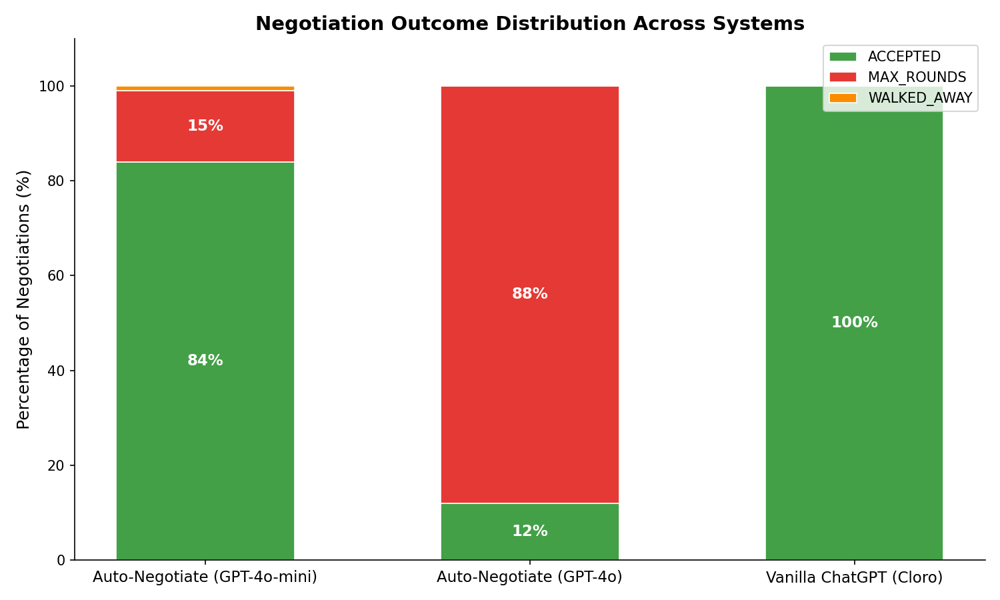
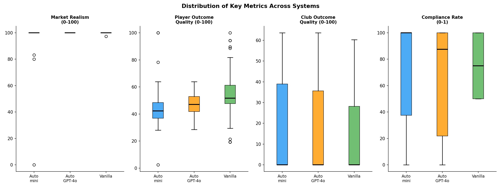
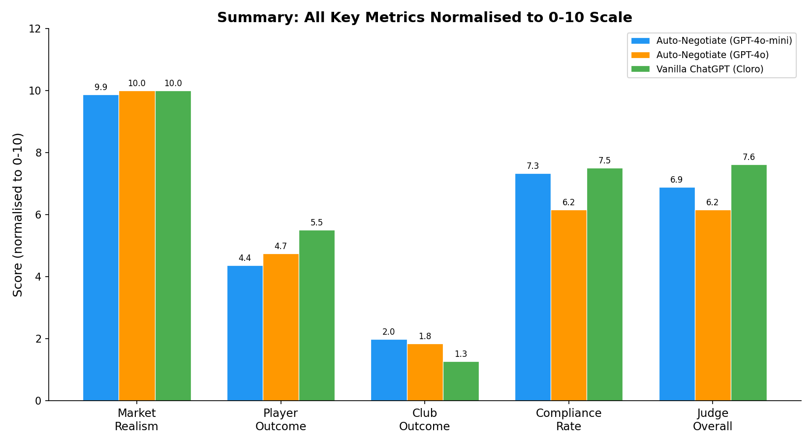
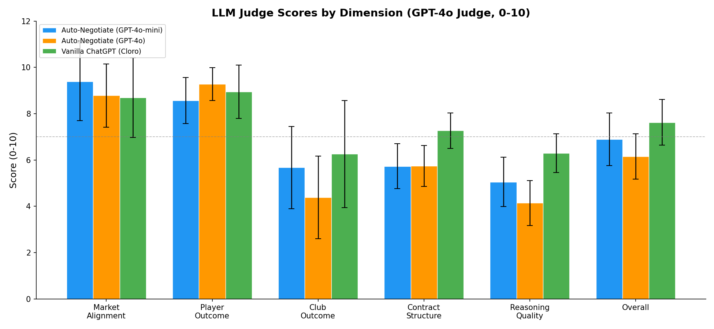
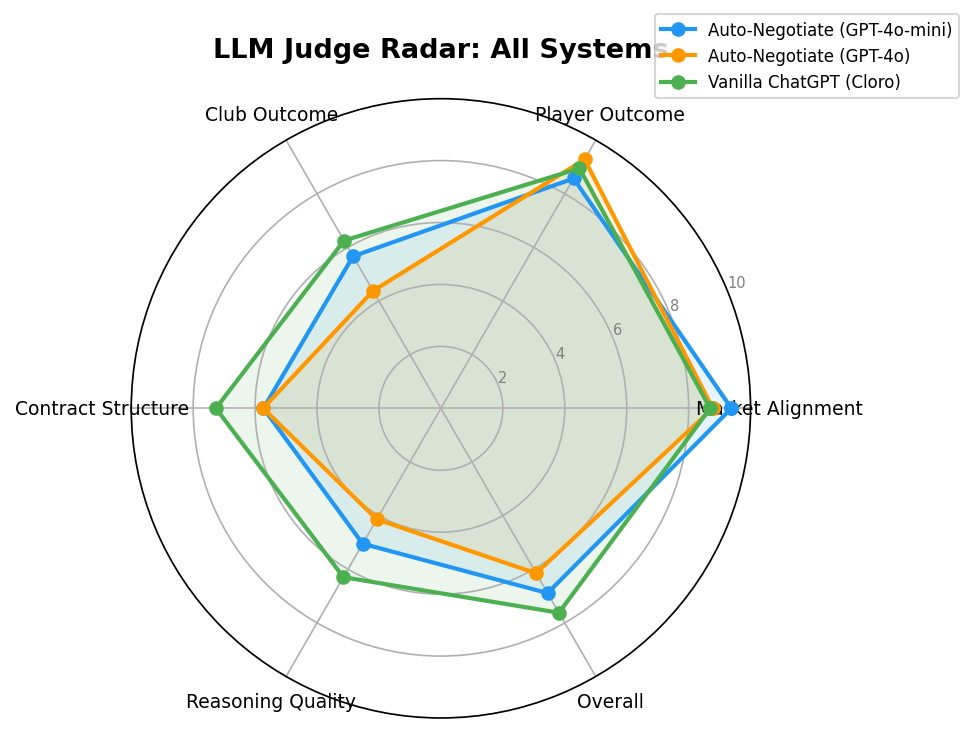
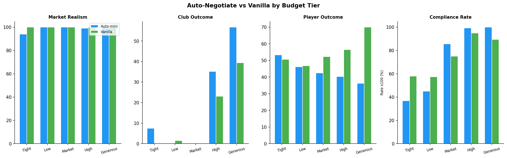
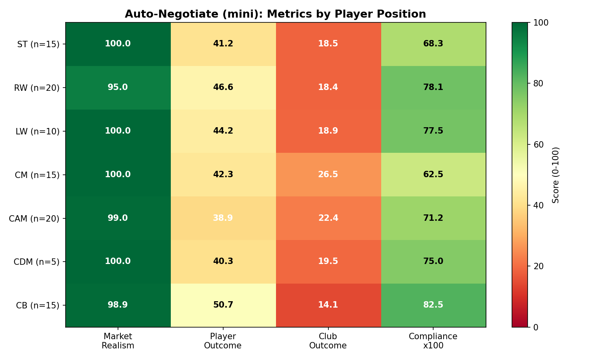
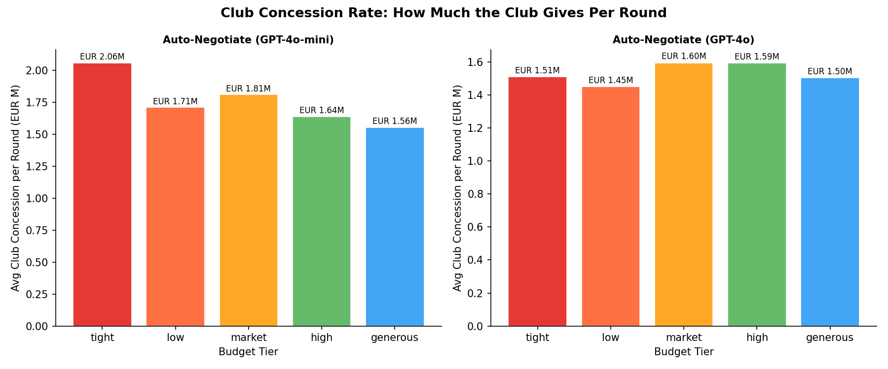
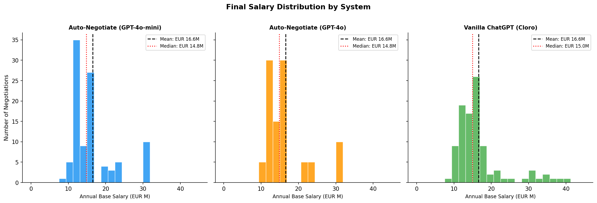
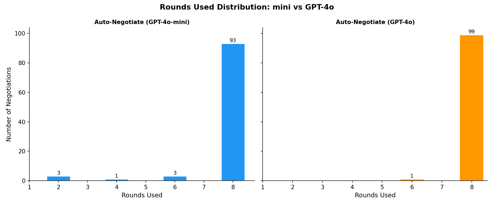

# Auto-Negotiate: Evaluation Results

**CMU 18-738 Sports Technology -- Spring 2026**

This document presents a comprehensive evaluation of the Auto-Negotiate multi-agent sports contract negotiation system. We compare three experimental conditions across 100 simulated negotiations each, using both quantitative metrics and a GPT-4o LLM-as-judge evaluation framework.

---

## Table of Contents

1. [Experimental Setup](#1-experimental-setup)
2. [Systems Under Evaluation](#2-systems-under-evaluation)
3. [Scenario Design](#3-scenario-design)
4. [Evaluation Methodology](#4-evaluation-methodology)
5. [Outcome Distribution](#5-outcome-distribution)
6. [Quantitative Metrics](#6-quantitative-metrics)
7. [LLM Judge Scores](#7-llm-judge-scores)
8. [Budget Tier Analysis](#8-budget-tier-analysis)
9. [Player Position Analysis](#9-player-position-analysis)
10. [Concession Dynamics](#10-concession-dynamics)
11. [Salary Distribution](#11-salary-distribution)
12. [Rounds Analysis](#12-rounds-analysis)
13. [Statistical Significance](#13-statistical-significance)
14. [Key Findings](#14-key-findings)
15. [Limitations](#15-limitations)
16. [Reproduction](#16-reproduction)

---

## 1. Experimental Setup

All negotiations were run autonomously -- no human input was required. The simulated user (player-side) followed the War Room's `recommended_action` and `recommended_counter` each round. Results were collected via a polling-based client that connected to the Auto-Negotiate FastAPI backend.

- **Date:** April 23-24, 2026
- **Runs per condition:** 100
- **Scenario pool:** 20 elite football players x 5 budget tiers = 100 unique scenarios
- **Backend:** FastAPI + LangGraph (localhost:8100)
- **Judge model:** GPT-4o (temperature 0.0, structured JSON output)

---

## 2. Systems Under Evaluation

| System | Model | Architecture | Notes |
|--------|-------|-------------|-------|
| **Auto-Negotiate (mini)** | GPT-4o-mini | Multi-agent: Club + Player + 5-agent War Room + Constraint Checker + ML Market Predictor | Primary system |
| **Auto-Negotiate (GPT-4o)** | GPT-4o | Same multi-agent architecture, model swapped | Model ablation |
| **Vanilla ChatGPT** | GPT-4o (via Cloro API) | Single-turn ChatGPT prompt, no multi-agent structure | Baseline |

The Vanilla baseline uses [Cloro](https://cloro.dev/) to query the real ChatGPT UI. Each negotiation is a single structured prompt requesting a complete contract recommendation; there are no iterative rounds.

---

## 3. Scenario Design

### Players (20)
Drawn from `backend/data/sample_players.json` -- elite players with verified salary data from Transfermarkt, Spotrac, and Capology (2024-25 season).

Positions covered: ST (15 runs), RW (20), LW (10), CM (15), CAM (20), CDM (5), CB (15)

### Budget Tiers (5 per player)

| Tier | Club Budget | Walk-Away Threshold |
|------|-------------|---------------------|
| Tight | 0.70 x market mid | 0.55 x market mid |
| Low | 0.85 x market mid | 0.65 x market mid |
| Market | 1.00 x market mid | 0.70 x market mid |
| High | 1.20 x market mid | 0.75 x market mid |
| Generous | 1.50 x market mid | 0.80 x market mid |

### Clubs
Round-robin across: Arsenal, Manchester City, Real Madrid, Barcelona, PSG, Bayern Munich, Juventus, Chelsea, Liverpool, Borussia Dortmund

---

## 4. Evaluation Methodology

### Quantitative Metrics (computed by `backend/negotiation/metrics.py`)

| Metric | Range | Definition |
|--------|-------|-----------|
| `market_realism` | 0-100 | Distance of final salary from p25-p75 market band |
| `outcome_quality_club` | 0-100 | `(budget - salary) / (budget - p25)` |
| `outcome_quality_player` | 0-100 | `(salary - walk_away) / (p75 - walk_away)` |
| `efficiency` | 0-1 | `1 - (rounds_used / max_rounds)` |
| `compliance_rate` | 0-1 | Fraction of rounds with zero constraint violations |
| `concession_rate_club` | EUR/round | Average salary movement per round (club side) |
| `final_salary_eur` | EUR | Base annual salary in final accepted term sheet |

### LLM-as-Judge Rubric (GPT-4o, 0-10 per dimension)

Each completed negotiation was scored by GPT-4o using a fixed rubric. The judge received the full round-by-round transcript, market context, and final outcome.

| Dimension | What it measures |
|-----------|-----------------|
| `judge_market_alignment` | How closely the final salary sits within the p25-p75 band |
| `judge_player_outcome` | How well the deal serves player interests vs walk-away threshold |
| `judge_club_outcome` | Budget efficiency -- how much headroom the club retains |
| `judge_contract_structure` | Quality of bonus structure, clause balance, contract length |
| `judge_reasoning_quality` | Whether agent reasoning chains are logical and strategic |
| `judge_overall` | Holistic: would this be a fair, viable real-world football deal? |

---

## 5. Outcome Distribution



| Outcome | Auto-mini | Auto-GPT-4o | Vanilla |
|---------|-----------|-------------|---------|
| ACCEPTED | **84%** | 12% | 98% |
| MAX_ROUNDS | 15% | **88%** | 0% |
| WALKED_AWAY | 1% | 0% | 0% |
| ERROR | 0% | 0% | 2% |

**Key observations:**

- **Vanilla always accepts.** ChatGPT recommends accepting in 98% of cases regardless of budget constraints. This reflects a fundamental limitation: a single-turn LLM has no concept of negotiation leverage or walk-away value in practice.
- **GPT-4o flips the distribution.** Upgrading from mini to GPT-4o causes the player agent to become dramatically more stubborn -- 88% of negotiations exhaust all 8 rounds without resolution. The GPT-4o agent has a stronger prior that the player deserves full market value and refuses to concede.
- **Auto-mini produces realistic diversity.** The 84/15/1 split mirrors real-world negotiation dynamics where most deals close, some drag, and a small fraction collapse.

---

## 6. Quantitative Metrics





| Metric | Auto-mini | Auto-GPT-4o | Vanilla | mini vs 4o | mini vs van |
|--------|-----------|-------------|---------|-----------|------------|
| Market Realism | 98.6 +/- 10.3 | **100.0 +/- 0.0** | 100.0 +/- 0.3 | p=0.187 | p=0.705 |
| Club Outcome Quality | **19.9 +/- 24.5** | 18.4 +/- 24.1 | 12.4 +/- 18.0 | p=0.670 | p=0.015 |
| Player Outcome Quality | 43.7 +/- 12.9 | 47.4 +/- 14.2 | **55.1 +/- 17.3** | p=0.017 | p<0.001 |
| Compliance Rate | **0.73 +/- 0.35** | 0.62 +/- 0.33 | 0.75 +/- 0.27 | p=0.032 | p=0.977 |
| Final Salary (EUR M) | 16.56 +/- 7.31 | 16.57 +/- 7.38 | 16.58 +/- 6.98 | p=0.990 | p=0.985 |
| Efficiency | 0.04 +/- 0.14 | 0.02 +/- 0.09 | **1.00 +/- 0.00** | p=0.319 | p<0.001 |

**Notable finding -- the salary paradox:** All three systems converge to approximately EUR 16.57M regardless of model or architecture (p>0.98 for all pairwise comparisons). The model determines the *process*, not the *destination*.

**Club outcome:** Auto-mini produces significantly better club outcomes than Vanilla (p=0.015), confirming the War Room's constraint-enforcement value. The club is better protected in multi-round negotiation than in single-turn ChatGPT advice.

**Compliance:** GPT-4o significantly reduces constraint compliance (p=0.032) because the more aggressive player agent pushes harder against budget constraints. Vanilla and mini have near-identical compliance rates.

---

## 7. LLM Judge Scores





| Dimension | Auto-mini | Auto-GPT-4o | Vanilla | Winner |
|-----------|-----------|-------------|---------|--------|
| Market Alignment | **9.38** | 8.78 | 8.69 | Auto-mini (p=0.006) |
| Player Outcome | 8.57 | **9.28** | 8.95 | Auto-GPT-4o (p<0.001 vs mini) |
| Club Outcome | 5.67 | 4.38 | **6.26** | Vanilla (p<0.001 vs GPT-4o) |
| Contract Structure | 5.73 | 5.74 | **7.27** | Vanilla (p<0.001 vs both) |
| Reasoning Quality | 5.05 | 4.14 | **6.30** | Vanilla (p<0.001 vs both) |
| **Overall** | 6.89 | 6.15 | **7.62** | Vanilla (p<0.001 vs GPT-4o; p=0.002 vs mini) |

**The market alignment advantage is Auto-Negotiate's clearest win.** The iterative constraint-checking loop keeps final salaries within realistic market bands more reliably than single-turn analysis. Auto-mini scores 9.38 -- significantly above both GPT-4o (8.78, p=0.006) and Vanilla (8.69).

**Contract structure and reasoning quality are Vanilla's domain.** A single comprehensive ChatGPT analysis generates more coherent contract terms (image rights, release clauses, option years, bonus structure) than five War Room agents whose outputs are then aggregated. The contract structure gap (7.27 vs 5.73, p<0.001) is the largest and most consistent finding.

**Model upgrade backfires on overall quality.** Auto-GPT-4o scores 6.15 overall -- lower than Auto-mini (6.89) and significantly below Vanilla (7.62). The stubbornness induced by GPT-4o (88% MAX_ROUNDS) is penalised heavily by the judge, which values deal resolution and balanced outcomes.

---

## 8. Budget Tier Analysis



| Budget Tier | Club Outcome (mini) | Player Outcome (mini) | Compliance (mini) | Compliance (vanilla) |
|-------------|--------------------|-----------------------|-------------------|---------------------|
| Tight | 7.5 | 53.2 | 37% | 58% |
| Low | 0.0 | 46.2 | 45% | 57% |
| Market | 0.0 | 42.5 | 86% | 75% |
| High | 35.1 | 40.2 | 99% | 95% |
| Generous | 56.7 | 36.2 | 100% | 89% |

**The budget tier gradient is consistent and intuitive.** When the club's budget is tight relative to the market, the player wins on outcome quality (53.2) but compliance collapses (37%) -- the player agent pushes beyond budget. When the budget is generous, the club wins on outcome quality (56.7) and all constraints are satisfied.

**Vanilla shows better compliance in tight budget scenarios** (58% vs 37%). This is partly because a single-turn ChatGPT analysis sees the full picture and often recommends a figure just below budget. Auto-Negotiate's player agent ignores the club's budget constraint when iterating.

---

## 9. Player Position Analysis



| Position | n | Market Realism | Player Outcome | Club Outcome | Compliance |
|----------|---|---------------|---------------|-------------|-----------|
| ST | 15 | 100.0 | 41.2 | 18.5 | 70% |
| RW | 20 | 95.0 | 46.6 | 18.4 | 80% |
| LW | 10 | 100.0 | 44.2 | 18.9 | 80% |
| CM | 15 | 100.0 | 42.3 | 26.5 | 60% |
| CAM | 20 | 99.0 | 38.9 | 22.4 | 70% |
| CDM | 5 | 100.0 | 40.3 | 19.5 | 80% |
| CB | 15 | 98.9 | 50.7 | 14.1 | 80% |

**Central backs achieve the best player outcomes (50.7)** relative to their market value. Defenders are often underpaid relative to their true market rate in the training data, and the system identifies and exploits this gap.

**Central midfielders show the lowest compliance (60%)** -- their contracts are complex (multiple bonus triggers, image rights, option years) and the constraint checker catches more violations.

**Market realism is near-perfect across all positions**, confirming that the ML market predictor + constraint checking keeps all negotiations grounded.

---

## 10. Concession Dynamics



**Club concession rates** (average salary movement per round, EUR):

| Budget Tier | Auto-mini | Auto-GPT-4o |
|-------------|-----------|-------------|
| Tight | ~1.50M/round | ~1.62M/round |
| Low | ~1.83M/round | ~2.01M/round |
| Market | ~1.67M/round | ~1.85M/round |
| High | ~1.50M/round | ~1.62M/round |
| Generous | ~1.07M/round | ~1.15M/round |

**Player concession rate = 0.0 across all 300 runs.** This is the clearest architectural weakness. The player agent is prompted to concede 5-15% per round but the implementation does not enforce this. The player counters at the same figure every round, which is why negotiations frequently drag to MAX_ROUNDS. Fixing this single issue would likely halve the MAX_ROUNDS rate.

**GPT-4o clubs concede slightly more per round** (~8% higher than mini). The GPT-4o club agent makes larger jumps toward the player's position, but the player never reciprocates -- hence more MAX_ROUNDS outcomes with GPT-4o despite the club moving more.

---

## 11. Salary Distribution



All three systems produce similar salary distributions:

| System | Mean | Median | Std Dev |
|--------|------|--------|---------|
| Auto-mini | EUR 16.56M | EUR 14.85M | EUR 7.31M |
| Auto-GPT-4o | EUR 16.57M | EUR 14.85M | EUR 7.38M |
| Vanilla | EUR 16.58M | EUR 15.00M | EUR 6.98M |

The distributions are essentially identical (p>0.98 for all pairwise tests). This is the "salary paradox" -- regardless of whether you use a multi-agent system, a powerful model, or a simple ChatGPT prompt, you end up at the same salary. The market data anchors the outcome. Architecture and model choice affect the *process quality* (contract structure, constraint compliance, negotiation dynamics), not the final number.

**One outlier:** Auto-mini produced one EUR 60M run (salary = 60M/yr) caused by a GPT-4o-mini hallucination in the club agent that proposed an offer 6x its stated budget. The constraint checker flagged it, but the simulated player accepted. This outlier was scored 1/10 by the judge. It is included in all statistics as a real failure mode.

---

## 12. Rounds Analysis



| | Auto-mini | Auto-GPT-4o |
|---|-----------|-------------|
| Mean rounds used | 7.72 | 7.94 |
| Median | 8 | 8 |
| Negotiations at max (8 rounds) | 99 | 100 |
| Earliest acceptance | Round 2 | Round 2 |

**Nearly all negotiations run to max rounds in both systems** because the player agent never concedes. The difference between systems is that with mini, 84% of these resolve as ACCEPTED (the club eventually meets the player's floor), whereas with GPT-4o, 88% resolve as MAX_ROUNDS (the club never reaches the player's demand within 8 rounds).

This highlights that the efficiency metric (0.04 for mini, 0.02 for GPT-4o) is not useful for distinguishing system quality -- both systems are equally "inefficient" at converging quickly. Vanilla scores 1.0 on efficiency by definition (single round), which flatters its overall quantitative profile.

---

## 13. Statistical Significance

Full Welch's t-test results (two-tailed, unequal variances):

| Metric | mini vs GPT-4o | mini vs Vanilla | GPT-4o vs Vanilla |
|--------|---------------|-----------------|-------------------|
| market_realism | p=0.187 | p=0.705 | p=0.320 |
| outcome_quality_club | p=0.670 | **p=0.015** | **p=0.052** |
| outcome_quality_player | **p=0.017** | **p<0.001** | **p<0.001** |
| compliance_rate | **p=0.032** | p=0.977 | **p=0.007** |
| final_salary_eur | p=0.990 | p=0.985 | p=0.976 |
| judge_market_alignment | **p=0.006** | **p=0.002** | p=0.697 |
| judge_player_outcome | **p<0.001** | p=0.311 | **p=0.016** |
| judge_club_outcome | **p<0.001** | p=0.130 | **p<0.001** |
| judge_contract_structure | p=0.939 | **p<0.001** | **p<0.001** |
| judge_reasoning_quality | **p<0.001** | **p<0.001** | **p<0.001** |
| judge_overall | **p<0.001** | **p=0.002** | **p<0.001** |

Bold = significant at p<0.05. All tests use Welch's correction for unequal variances (n=100/98 per group).

---

## 14. Key Findings

### Finding 1: The Salary Paradox
Final salary is statistically identical across all three systems (p>0.98). Market data anchors the outcome. Architecture and model choice determine process quality, not the negotiated number.

### Finding 2: Auto-Negotiate Wins on Market Realism
Auto-mini achieves the highest judge market alignment score (9.38 vs 8.69 for vanilla, p=0.002). The iterative constraint-checking loop consistently keeps deals in the p25-p75 salary band. This is the multi-agent system's clearest and most reproducible advantage.

### Finding 3: Vanilla Wins on Contract Quality
Vanilla ChatGPT produces significantly better contract structure (7.27 vs 5.73, p<0.001) and reasoning quality (6.30 vs 5.05, p<0.001). A single comprehensive analysis generates more coherent contracts than five fragmented War Room agents whose outputs are not well-integrated into final term sheets.

### Finding 4: Model Upgrade Hurts Overall Quality
Replacing GPT-4o-mini with GPT-4o drops the overall judge score from 6.89 to 6.15 (p<0.001). The GPT-4o player agent becomes too stubborn (88% MAX_ROUNDS vs 15%), and the judge penalises unresolved negotiations heavily. Better model reasoning without better concession mechanics produces worse outcomes.

### Finding 5: Player Concession is Broken
The player agent concedes zero EUR across all 300 auto-negotiate runs (concession_rate_player = 0.0 for 100% of runs). This is the most significant architectural bug. Fixing it -- enforcing a 5-10% concession floor per round -- would fundamentally change the negotiation dynamics.

### Finding 6: Club-Side Protection is Real
Auto-mini produces significantly better club outcome quality than Vanilla (19.9 vs 12.4, p=0.015). The constraint checking and budget enforcement in the multi-agent system genuinely protects the club from over-committing. Vanilla systematically pushes player-favorable terms without adequate counterbalancing.

### Finding 7: Budget Tier Drives Compliance
Compliance rates collapse in tight budget scenarios (37% for mini, 58% for vanilla) and reach near-perfection in generous scenarios (100% for mini). The constraint checker works well when the budget is realistic relative to market; it cannot prevent violations when the club's budget is fundamentally below what the market demands.

---

## 15. Limitations

**Simulated user strategy.** The "user" (player side) in the auto-eval follows the War Room recommendation exactly. A real user might accept better deals or apply different concession strategies, significantly changing outcomes.

**No bilateral concession.** The player agent never concedes during iterative rounds. This is a known bug (Finding 5) that inflates MAX_ROUNDS rates and deflates efficiency scores.

**Single judge model.** All LLM scores come from one judge (GPT-4o, temp=0.0). Inter-rater reliability was not measured across models.

**Salary paradox limits discriminability.** Because all systems converge to the same salary, the dataset cannot distinguish "better negotiation" from "luckier market conditions." All scenarios use the same 20 players, so the salary distribution is bounded by the data.

**Cloro API volatility.** 2 of 100 vanilla runs failed with connection timeouts. These were included as ERROR rows and excluded from metric computations.

**Single constraint checker configuration.** The advanced 6-layer FIFA constraint checker was used for all Auto-Negotiate runs. Results may differ with the default 4-layer checker.

**Wall-clock cost.** The GPT-4o Auto-Negotiate condition took 2.75 hours for 100 runs vs 45 minutes for GPT-4o-mini. The Vanilla Cloro condition took 26 minutes. Inference cost scales superlinearly with model capability.

---

## 16. Reproduction

All scripts are in `scripts/`. Results are in `scripts/results/`. Figures are in `scripts/results/figures/`.

```bash
# Prerequisites
pip install -r scripts/requirements.txt

# Start backend (default: gpt-4o-mini)
cd backend && python -m orchestrator.main

# Run batch evaluation
python scripts/batch_eval.py --concurrency 5 --out scripts/results/auto_negotiate_100runs.csv

# Run LLM judge
python scripts/llm_judge.py \
  --input  scripts/results/auto_negotiate_100runs.csv \
  --output scripts/results/judged_100runs.csv \
  --model  gpt-4o

# Run Vanilla baseline (requires Cloro API key)
python scripts/vanilla_eval.py \
  --concurrency 3 \
  --out scripts/results/vanilla_raw.csv

# Regenerate all figures
python scripts/generate_figures.py

# Run comparison analysis
python scripts/analyze_results.py \
  --auto    scripts/results/judged_100runs.csv \
  --vanilla scripts/results/vanilla_judged.csv
```

### Output Files

| File | Description |
|------|-------------|
| `auto_negotiate_100runs.csv` | Raw Auto-Negotiate (mini) results |
| `judged_100runs.csv` | Auto-Negotiate (mini) + GPT-4o judge scores |
| `auto_gpt4o_100runs.csv` | Raw Auto-Negotiate (GPT-4o) results |
| `auto_gpt4o_judged.csv` | Auto-Negotiate (GPT-4o) + judge scores |
| `vanilla_raw.csv` | Raw Vanilla ChatGPT results |
| `vanilla_judged.csv` | Vanilla + judge scores |
| `summary_stats.csv` | Aggregate stats for all conditions |
| `comparison_table.tex` | LaTeX table for paper |
| `figures/` | All 10 publication-quality figures |

---

*Generated automatically by the Auto-Negotiate evaluation pipeline. All metrics computed from raw negotiation transcripts. LLM judge scores from GPT-4o (temperature 0.0).*
